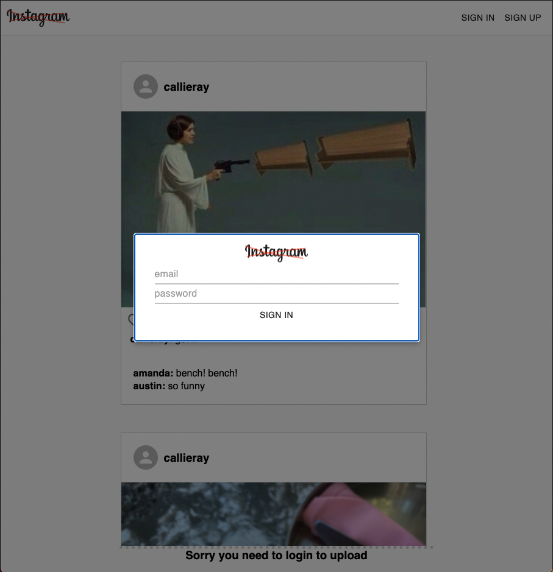
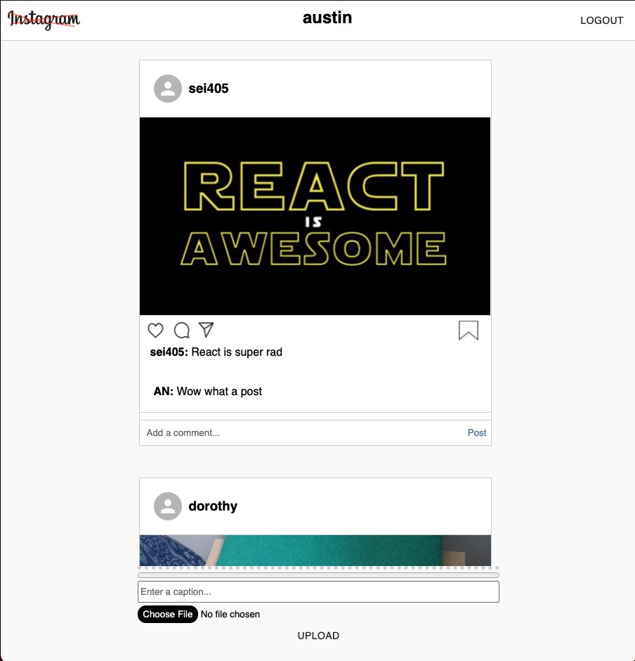

Insta Clone is a web app based on the popular website, "Instagram".   Uses full CRUD implementing cloud based Firebase to handle all of the backend and auth.

# Technologies used: REACT - FIREBASE - MATERIAL-UI - HTML - CSS

## Screenshot 1

## Screenshot 2

# Run "$npm i" to install required dependencies

## Available Scripts

In the project directory, you can run:

### `npm start`

Runs the app in the development mode.\
Open [http://localhost:3000](http://localhost:3000) to view it in the browser.

The page will reload if you make edits.\
You will also see any lint errors in the console.

### `npm test`

Launches the test runner in the interactive watch mode.\
See the section about [running tests](https://facebook.github.io/create-react-app/docs/running-tests) for more information.

## Learn More

You can learn more in the [Create React App documentation](https://facebook.github.io/create-react-app/docs/getting-started).

